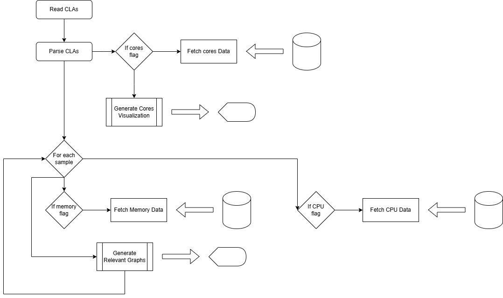

# CSCB09 Assignment 3 - System Monitoring Tool -- Concurrency & Signals
By: Bo Rui Duanmu

April 4th, 2025

## Introduction
This is a program that presents system information in real-time in graphical form by displaying at each instant of time how the quantities are changing. This program presents memory usage and CPU usage in the form of a graph, provides a visual representation of the number of cores as well as the maximum frequency of the cores. 

## How I Approached the Problem
I approached this problem in four stages, retrieving data, processing the data, outputting the data, and optimizations. For retrieving the data, I used a mix of Linux `proc` files and C libraries. For processing, I used formulas and equations provided in class and found online to process the raw data into usable data. For outputting, I used escape codes to format and output graphs in real time. For optimizations, I used concurrency to efficiently collect the data, splitting the collection of each type of data into different processes, and I interrupted the `CTRL + C` and `CTRL + Z` signals to prevent any unexpected errors. 

## Implementation
The program works by first taking the user input and storing them in an array. This keeps track of what graphs to output, the number of samples to take and the delay between each sample. Then, for each graph it needs to output, it forks into a child process to collect that data. The main process then reads this data using pipes, and processes and outputs them. This program has four additional modules: `memory-info`, `cpu-info`, `cores-info`, and `output-utils`. Each `-info` module has functions which retrieve and process their respective data. `output-utils` has functions to output each graph. 

### `memory-info`
This module has two functions:

* `retrieveMemoryData`
    * This function retrieves the total RAM and free RAM using `sysinfo`.
* `processMemoryUtilization`
    * This function processes total RAM and free RAM into GiB. 

### `cpu-info`
This module has two functions:

* `retrieveCPUData`
    * This function retrieves various CPU times using `/proc/stat/`.
* `processCPUUtilization`
    * This function processes the CPU times into a utilization percentage.

### `cores-info`
This module has one function:

* `retrieveCoresData`
    * This function retrieves the maximum frequency of the cores by using `/sys/devices/system/cpu/cpu0/cpufreq/cpuinfo_max_freq/`. It assumes all cores have the same frequency, which we are allowed to do. It also finds the number of cores using `/proc/cpuinfo/`. 

### `output_utils`
This module has three functions:

* `outputMemoryUtilization`
    * This function outputs the memory utilization graph. It outputs the axes and a single point of data. It is designed in a way so it can be called multiple times and the format will stay the same. 
* `outputCPUUtilization`
    * This function outputs the CPU utilization graph. It outputs the axes and a single point of data. It is designed in a way so it can be called multiple times and the format will stay the same. 
* `outputCores`
    * This function outputs the cores information as well as a visual representation of the number of cores.

### `system-monitoring-tool`
This is the driver module and it has seven functions:

* `sigint`
    * This function is the `SIGINT` signal handler and iterrupts `CTRL + C` signals. When `CTRL + C` is pressed the program will pause and it will prompt the user for confirmation. If the user wants to quit, the program will exit. Otherwise, the program will continue running. Note, the child processes will continue collecting data while the program is paused. As such, graphs will update with a lag equal to the duration the program spent paused upon continuation. 
* `processArguments`
    * This function takes in the argument count and argument list and stores the specifications of the program in an array passed to the function. If given any of the flags specified in the assignment description, it will appropriately store the information in the passed in array. If given no appropriate flags, the default settings will be applied. Any invalid arguments will be ignored.
* `delay`
    * This function uses the `time` library to delay the program by the specified duration. 
* `writeMemoryData`
    * This is a function used by the child processes to retrieve and write memory data to a pipe. 
* `writeCPUData`
    * This is a function used by the child processes to retrieve and write CPU data to a pipe. 
* `writeCoresData`
    * This is a function used by the child processes to retrieve and write cores data to a pipe. 
* `main`
    * The main function first processes the arguments, then forks into the appropriate amount of children given the information specified. The children then collect their respective data and exit. The parent process will simultaneously process and output the data retrieved by the child processes, interrupting any signals along the way. 

## Flow Chart

## How to Compile
This file uses a makefile. The `make all` or `make` rule compiles the program using the proper compiler and flags into an executable called `system-monitoring-tool` by linking all the `.c` files into a single executable. The `make clean` rule cleans the files by removing the `.o` files and the executable. 

This program can be run with up to five command line arguments: 
* `--memory` to indicate the memory usage graph should be generated.
* `--cpu` to indicate the CPU usage graph should be generated.
* `--cores` to indicate the cores information should be generated.
* `--samples=N` to indicate there will be N repititions meaning data will be sampled N times. If not indicated the default value is 20.
* `--tdelay=T` to indicate between each sample there will be a T microseconds delay. If not indicated the default value is 500000.

The number of samples and delay can also be passed as positional arguments. `samples` can be passed as the first argument and `tdelay` can be passed as the second. 

In the case both the positional arguments and `--samples=N` or `--tdelay-T` or multiple verions of `--samples=N` or `--tdelay-T` are passed in, the last argument will be used. If multiple of the other flags are passed, it will be treated as if there were only one.

The number of samples and the delay should both be positive integers. Additionally, the delay should be greater than 10000 microseconds. Should invalid inputs (i.e. 0, -12, "akljf") be passed in, the default values will be used. For the sake of formatting, **it is assumed that the number of samples is less than the width of the terminal.** The program still runs with such inputs, but unexpected results may occur. 

## Expected Results

With no additional input, the program should output two live updating graph which collects 20 samples, once every 500000 microseconds. The first graph shows the memory utilization, and the second graph shows the CPU utilization. After the graphs are finished, the cores information will be shown along with a visual representation of the number of cores. The user can decide to not show certain graphs, in which case the graphs will be pushed up to remove any blank space. The user can also specify the number of samples or the delay between each sample, in which case the program will update accordingly. 

## Test Cases

Here are some test cases to consider: 

* `./system-monitoring-tool`
    * 20 samples with 500000 microseconds delay, showing memory usage, CPU usage, and cores info.
* `./system-monitoring-tool 10 1000000 --cpu` 
    * 10 samples with 1000000 microseconds delay, showing only CPU usage.
* `./system-monitoring-tool --memory --cores --samples=60`
    * 60 samples with 500000 microseconds delay, showing memory usage and cores info.
* `./system-monitoring-tool 10 500001 --tdelay=800000 --samples=99 --samples=16 --cores` 
    * 16 samples with 800000 microseconds delay, showing only cores info.
* `./system-monitoring-tool --tdelay=250000 600000`
    * 20 samples with 600000 microseconds delay, showing memory usage, CPU usage, and cores info.
* `./system-monitoring-tool khsahfakjh 0 od fja ndfjkasn jk aJFK JEN A K a`
    * 20 samples with 500000 microseconds delay, showing memory usage, CPU usage, and cores info.
* `./system-monitoring-tool 5 --tdelay=3000`
    * 5 samples with 500000 microseconds delay, showing memory usage, CPU usage, and cores info.

## Disclaimers

In the case that any information cannot be retrieved, the program will skip that graph and in its place will be an error message informing the user that such data was unable to be collected. 